# Cookie-Based Authentication & Session Management Implementation Plan

## Overview
Implement bmcweb-style cookie-based authentication and session management to replace hardcoded Basic auth in the Vue UI.

## Current State
- Vue UI uses hardcoded Basic auth (`admin:password` in base64)
- No session management
- No login/logout UI
- No CSRF protection
- Auth middleware checks for `/api/` prefix only

## Target State (bmcweb-style)
- Cookie-based authentication with SESSION cookie
- Session management with timeout (60 minutes)
- CSRF token protection
- Login/logout UI
- Multiple authentication methods (Cookie, Basic, Token)
- Secure random token generation

## Implementation Plan

### Phase 1: Backend Session Management

#### 1.1 Create Session Management Structure
**File**: `src/bmcweb/session.hpp` (new)
- Create `UserSession` struct with:
  - `uniqueId` (10 chars) - unique session identifier
  - `sessionToken` (20 chars) - authentication token
  - `username` - authenticated user
  - `csrfToken` (20 chars) - CSRF protection token
  - `lastUpdated` - timestamp for timeout
  - `persistence` - TIMEOUT or SINGLE_REQUEST enum

**File**: `src/bmcweb/session.cpp` (new)
- Create `SessionStore` class with:
  - `generateUserSession(username, persistence)` - creates new session
  - `loginSessionByToken(token)` - validates session by token
  - `getSessionByUid(uid)` - get session by unique ID
  - `removeSession(session)` - delete session
  - `applySessionTimeouts()` - clean up expired sessions (60 min)
  - Singleton pattern for global access
  - Secure random token generation (62 alphanum chars, 178 bits entropy)

#### 1.2 Create Login/Logout API Endpoints
**File**: `src/bmcweb/routes/auth.cpp` (new)
- `POST /api/login` - Login endpoint
  - Accept: `{ username, password }`
  - Validate credentials via existing PasswordManager
  - Create session via SessionStore
  - Return: `{ sessionToken, csrfToken, username }`
  - Set SESSION cookie

- `POST /api/logout` - Logout endpoint
  - Validate session
  - Remove session from SessionStore
  - Clear SESSION cookie
  - Return success message

- `GET /api/session` - Get current session info
  - Validate session via cookie or token
  - Return session info

#### 1.3 Update Authentication Middleware
**File**: `src/auth/middleware/AuthMiddleware.cpp`
- Add cookie authentication support:
  - Check for `SESSION=` cookie
  - Validate session token via SessionStore
  - Update session lastUpdated timestamp
- Add CSRF token validation for POST/PUT/DELETE:
  - Check `X-CSRF-Token` header
  - Validate against session's csrfToken
- Keep Basic auth as fallback
- Add session context to request

#### 1.4 Update CMakeLists.txt
- Add new files to build:
  - `src/bmcweb/session.cpp`
  - `src/bmcweb/routes/auth.cpp`

### Phase 2: Frontend Authentication UI

#### 2.1 Create Login Page
**File**: `webui/src/views/Login.vue` (new)
- Login form with username/password fields
- Call `/api/login` endpoint
- Store sessionToken and csrfToken
- Set SESSION cookie
- Redirect to dashboard on success
- Error handling for invalid credentials

#### 2.2 Create Authentication Store
**File**: `webui/src/store/auth.js` (new)
- Pinia store for auth state:
  - `isAuthenticated` - boolean
  - `user` - username
  - `sessionToken` - session token
  - `csrfToken` - CSRF token
- Actions:
  - `login(username, password)` - authenticate
  - `logout()` - clear session
  - `checkSession()` - validate current session

#### 2.3 Update API Client
**File**: `webui/src/api/index.js`
- Remove hardcoded Basic auth
- Add session token to Authorization header as `Token <sessionToken>`
- Add CSRF token to X-CSRF-Token header for POST/PUT/DELETE
- Handle 401 errors by redirecting to login
- Add interceptors for automatic token injection

#### 2.4 Update Router
**File**: `webui/src/router/index.js`
- Add login route
- Add route guard to check authentication
- Redirect to login if not authenticated
- Store redirect URL for post-login redirect

#### 2.5 Update App Component
**File**: `webui/src/App.vue`
- Add logout button to navbar
- Show username when authenticated
- Conditionally show navbar (hide on login page)

## Sequence Diagrams

### Login Flow

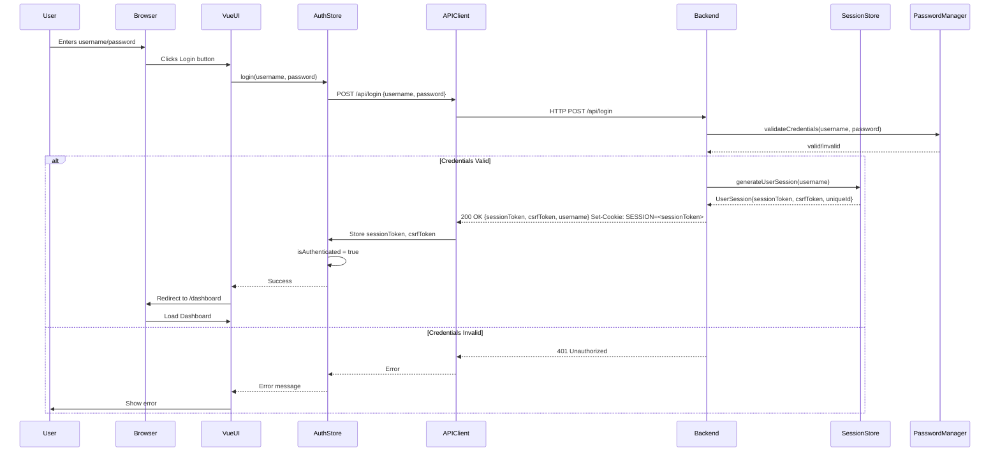

### Authenticated API Request Flow

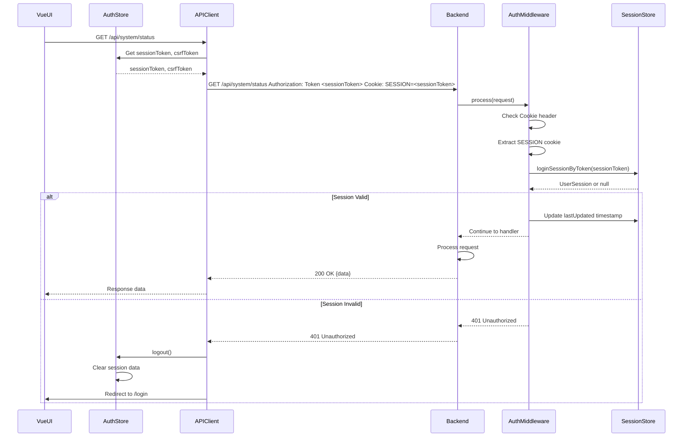

### POST Request with CSRF Protection

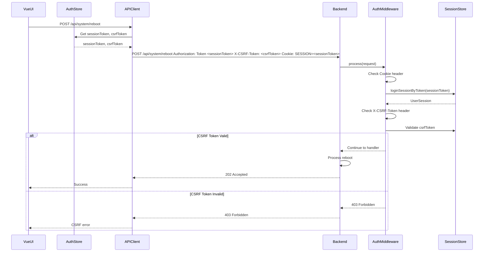

### Logout Flow

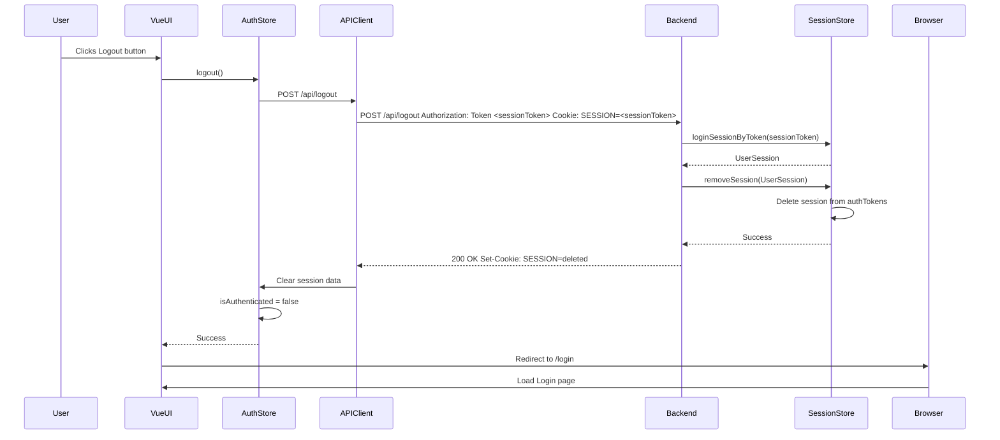

### Session Timeout Flow

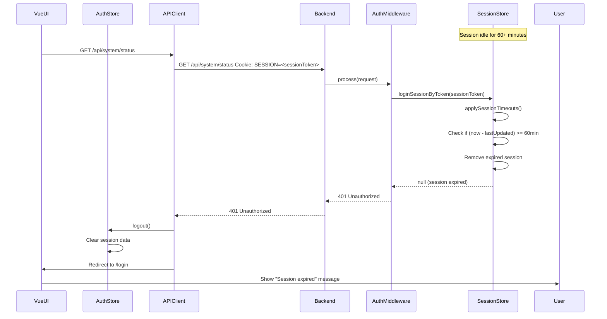

### Session Cleanup Background Process

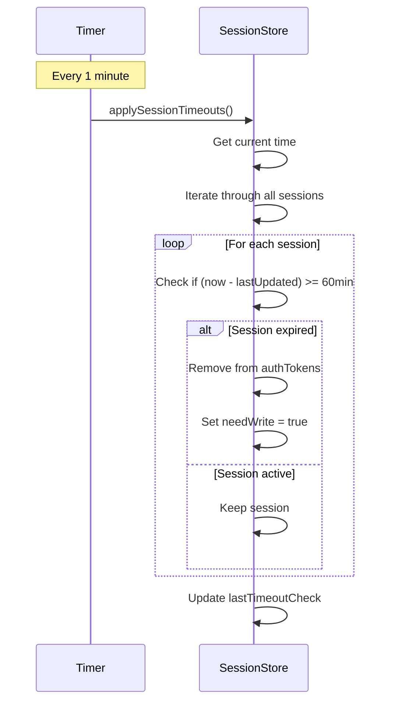

### Basic Auth Fallback Flow

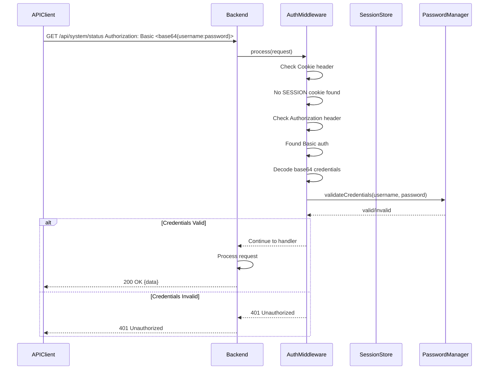

### Router Guard Flow

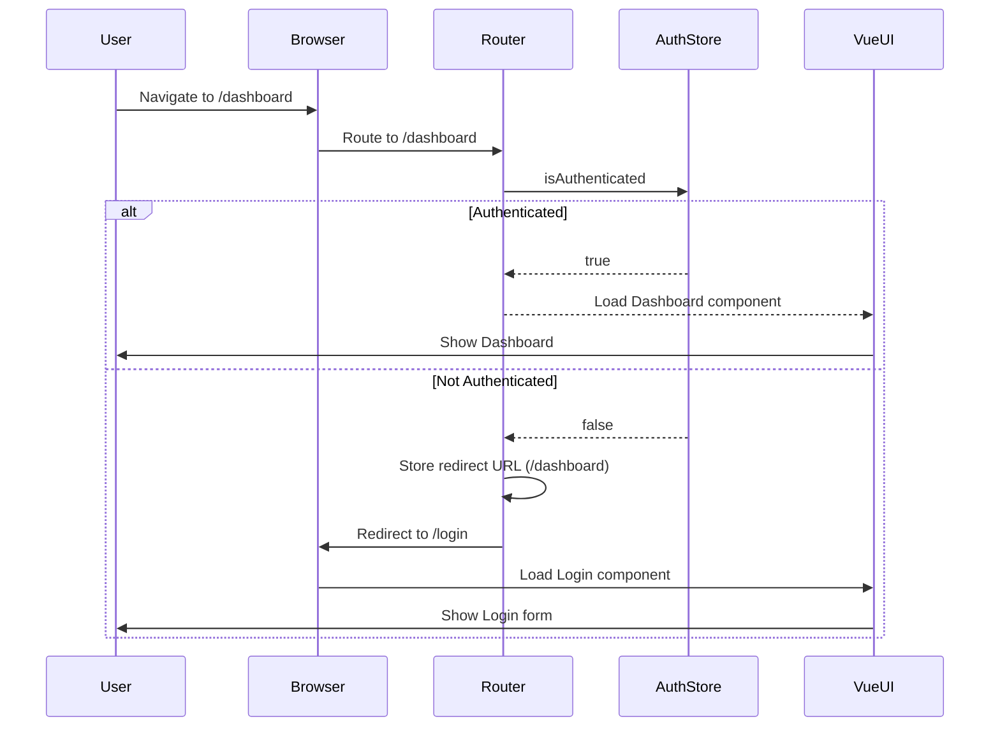

### Post-Login Redirect Flow

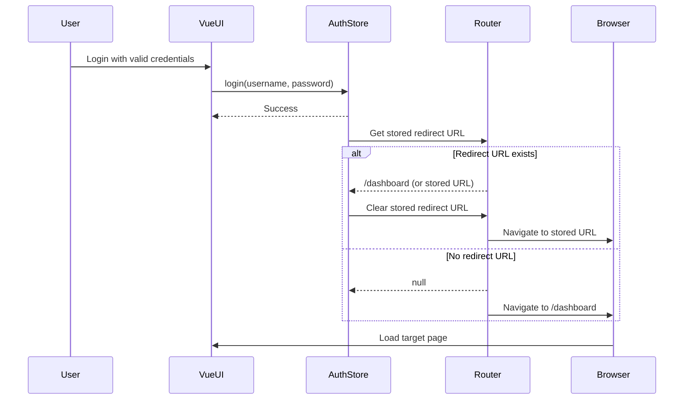

### Component Architecture Diagram

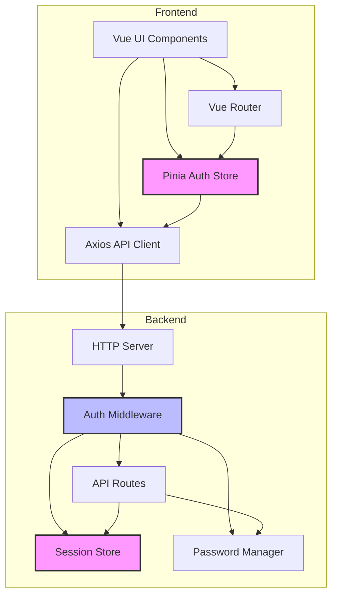

### Data Flow Diagram

```mermaid
graph LR
    A[User Login] --> B[POST /api/login]
    B --> C[Validate Credentials]
    C -->|Valid| D[Generate Session]
    C -->|Invalid| E[Return 401]
    D --> F[Store in SessionStore]
    F --> G[Return sessionToken + csrfToken]
    G --> H[Store in AuthStore]
    H --> I[Set SESSION Cookie]
    I --> J[Subsequent API Calls]
    J --> K[Include sessionToken in headers]
    K --> L[Validate via AuthMiddleware]
    L --> M[Check SessionStore]
    M -->|Valid| N[Process Request]
    M -->|Invalid| O[Return 401]
    O --> P[Redirect to Login]
    
    style D fill:#f9f,stroke:#333,stroke-width:2px
    style F fill:#f9f,stroke:#333,stroke-width:2px
    style L fill:#bbf,stroke:#333,stroke-width:2px
    style M fill:#bbf,stroke:#333,stroke-width:2px
```

## Phase 3: Testing & Integration

#### 3.1 Backend Testing
- Test login endpoint with valid credentials
- Test login endpoint with invalid credentials
- Test session validation
- Test session timeout
- Test logout
- Test CSRF protection (try without CSRF token)
- Test cookie authentication
- Test fallback to Basic auth

#### 3.2 Frontend Testing
- Test login flow
- Test logout flow
- Test session persistence across page refresh
- Test redirect to login on 401
- Test CSRF token injection
- Test protected routes

#### 3.3 Integration Testing
- Test complete login -> dashboard flow
- Test session timeout handling
- Test concurrent sessions
- Test security scenarios (CSRF, session hijacking)

## Security Considerations

1. **Token Generation**
   - Use cryptographically secure random generator
   - 178 bits of entropy (20 chars from 62 alphanum)
   - OWASP recommends at least 60 bits

2. **Session Timeout**
   - 60-minute idle timeout
   - Update lastUpdated on each request
   - Clean up expired sessions every minute

3. **CSRF Protection**
   - Required for all state-changing requests (POST/PUT/DELETE)
   - Validate X-CSRF-Token header against session's csrfToken
   - CSRF token only returned on login

4. **Cookie Security**
   - HttpOnly flag (prevent JavaScript access)
   - Secure flag (HTTPS only - for production)
   - SameSite=Strict (prevent CSRF)

5. **Password Security**
   - Use existing PasswordManager with bcrypt
   - Never log passwords
   - Rate limit login attempts

## Dependencies

### Backend
- Existing: PasswordManager, UserManager
- New: SessionStore, random number generation
- No new external dependencies needed

### Frontend
- Existing: axios, vue-router, pinia
- No new dependencies needed

## Rollout Plan

1. Implement backend session management (Phase 1)
2. Test backend with curl/Postman
3. Implement frontend auth UI (Phase 2)
4. Test complete flow
5. Update documentation
6. Deploy

## Backward Compatibility

- Keep Basic auth as fallback for API clients
- Existing API tests should continue to work
- Gradual migration from Basic to Cookie auth

## Success Criteria

- [ ] Users can login via web UI
- [ ] Sessions timeout after 60 minutes of inactivity
- [ ] CSRF protection prevents cross-site attacks
- [ ] Logout properly clears session
- [ ] Basic auth still works for API clients
- [ ] All existing tests pass
- [ ] No hardcoded credentials in frontend
