# Protocol Interface Architecture

## Overview

The streaming system uses a protocol interface pattern to provide a clean, extensible architecture for supporting multiple streaming protocols (MJPEG, UDP/RTP, RTSP, WebRTC, HLS). Each protocol implements a common interface while providing protocol-specific optimizations and features.

## Architecture Diagram

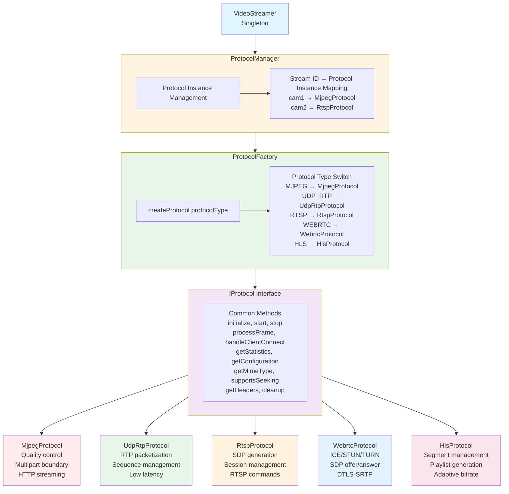
```mermaid
graph TB
    VS[VideoStreamer<br/>Singleton]
    
    subgraph PM [ProtocolManager]
        PIM[Protocol Instance Management]
        MAP[Stream ID → Protocol Instance Mapping<br/>cam1 → MjpegProtocol<br/>cam2 → RtspProtocol]
        PIM --> MAP
    end
    
    subgraph PF [ProtocolFactory]
        CP[createProtocol protocolType]
        PTS[Protocol Type Switch<br/>MJPEG → MjpegProtocol<br/>UDP_RTP → UdpRtpProtocol<br/>RTSP → RtspProtocol<br/>WEBRTC → WebrtcProtocol<br/>HLS → HlsProtocol]
        CP --> PTS
    end
    
    subgraph IP [IProtocol Interface]
        CM[Common Methods<br/>initialize, start, stop<br/>processFrame, handleClientConnect<br/>getStatistics, getConfiguration<br/>getMimeType, supportsSeeking<br/>getHeaders, cleanup]
    end
    
    VS --> PM
    PM --> PF
    PF --> IP
    
    IP --> MJPEG[MjpegProtocol<br/>Quality control<br/>Multipart boundary<br/>HTTP streaming]
    IP --> UDP[UdpRtpProtocol<br/>RTP packetization<br/>Sequence management<br/>Low latency]
    IP --> RTSP[RtspProtocol<br/>SDP generation<br/>Session management<br/>RTSP commands]
    IP --> WEBRTC[WebrtcProtocol<br/>ICE/STUN/TURN<br/>SDP offer/answer<br/>DTLS-SRTP]
    IP --> HLS[HlsProtocol<br/>Segment management<br/>Playlist generation<br/>Adaptive bitrate]
    
    style VS fill:#e1f5ff
    style PM fill:#fff4e1
    style PF fill:#e8f5e9
    style IP fill:#f3e5f5
    style MJPEG fill:#ffebee
    style UDP fill:#e8f5e9
    style RTSP fill:#fff3e0
    style WEBRTC fill:#e3f2fd
    style HLS fill:#fce4ec
```

## Class Hierarchy

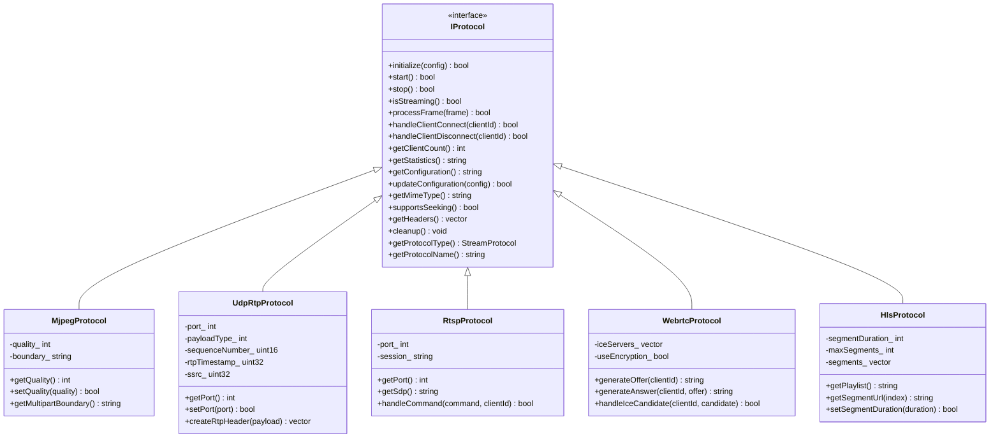
```mermaid
classDiagram
    class IProtocol {
        <<interface>>
        +initialize(config) bool
        +start() bool
        +stop() bool
        +isStreaming() bool
        +processFrame(frame) bool
        +handleClientConnect(clientId) bool
        +handleClientDisconnect(clientId) bool
        +getClientCount() int
        +getStatistics() string
        +getConfiguration() string
        +updateConfiguration(config) bool
        +getMimeType() string
        +supportsSeeking() bool
        +getHeaders() vector
        +cleanup() void
        +getProtocolType() StreamProtocol
        +getProtocolName() string
    }
    
    class MjpegProtocol {
        -quality_ int
        -boundary_ string
        +getQuality() int
        +setQuality(quality) bool
        +getMultipartBoundary() string
    }
    
    class UdpRtpProtocol {
        -port_ int
        -payloadType_ int
        -sequenceNumber_ uint16
        -rtpTimestamp_ uint32
        -ssrc_ uint32
        +getPort() int
        +setPort(port) bool
        +createRtpHeader(payload) vector
    }
    
    class RtspProtocol {
        -port_ int
        -session_ string
        +getPort() int
        +getSdp() string
        +handleCommand(command, clientId) bool
    }
    
    class WebrtcProtocol {
        -iceServers_ vector
        -useEncryption_ bool
        +generateOffer(clientId) string
        +generateAnswer(clientId, offer) string
        +handleIceCandidate(clientId, candidate) bool
    }
    
    class HlsProtocol {
        -segmentDuration_ int
        -maxSegments_ int
        -segments_ vector
        +getPlaylist() string
        +getSegmentUrl(index) string
        +setSegmentDuration(duration) bool
    }
    
    IProtocol <|-- MjpegProtocol
    IProtocol <|-- UdpRtpProtocol
    IProtocol <|-- RtspProtocol
    IProtocol <|-- WebrtcProtocol
    IProtocol <|-- HlsProtocol
```

## Protocol Creation Flow

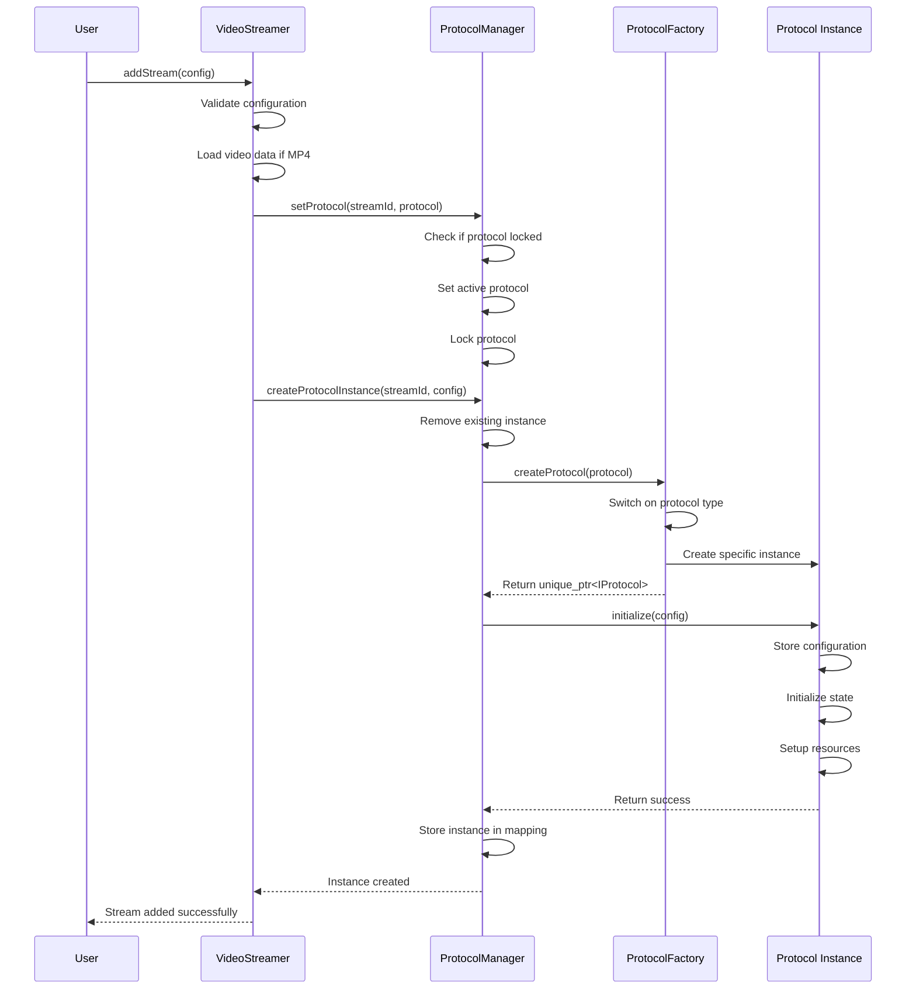
```mermaid
sequenceDiagram
    participant User
    participant VS as VideoStreamer
    participant PM as ProtocolManager
    participant PF as ProtocolFactory
    participant Proto as Protocol Instance
    
    User->>VS: addStream(config)
    VS->>VS: Validate configuration
    VS->>VS: Load video data if MP4
    
    VS->>PM: setProtocol(streamId, protocol)
    PM->>PM: Check if protocol locked
    PM->>PM: Set active protocol
    PM->>PM: Lock protocol
    
    VS->>PM: createProtocolInstance(streamId, config)
    PM->>PM: Remove existing instance
    PM->>PF: createProtocol(protocol)
    
    PF->>PF: Switch on protocol type
    PF->>Proto: Create specific instance
    PF-->>PM: Return unique_ptr<IProtocol>
    
    PM->>Proto: initialize(config)
    Proto->>Proto: Store configuration
    Proto->>Proto: Initialize state
    Proto->>Proto: Setup resources
    Proto-->>PM: Return success
    
    PM->>PM: Store instance in mapping
    PM-->>VS: Instance created
    VS-->>User: Stream added successfully
```

## Streaming Flow

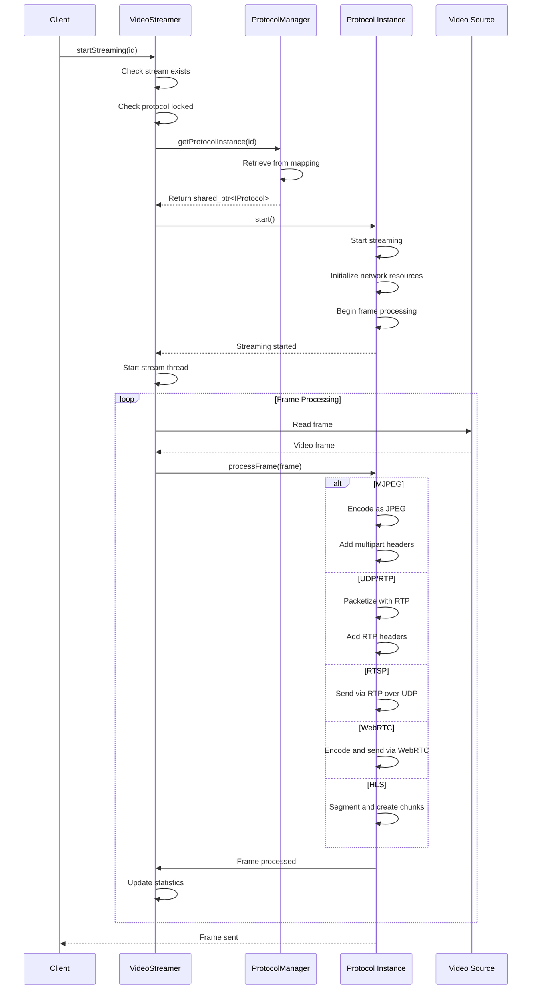
```mermaid
sequenceDiagram
    participant Client
    participant VS as VideoStreamer
    participant PM as ProtocolManager
    participant Proto as Protocol Instance
    participant Source as Video Source
    
    Client->>VS: startStreaming(id)
    VS->>VS: Check stream exists
    VS->>VS: Check protocol locked
    VS->>PM: getProtocolInstance(id)
    
    PM->>PM: Retrieve from mapping
    PM-->>VS: Return shared_ptr<IProtocol>
    
    VS->>Proto: start()
    Proto->>Proto: Start streaming
    Proto->>Proto: Initialize network resources
    Proto->>Proto: Begin frame processing
    Proto-->>VS: Streaming started
    
    VS->>VS: Start stream thread
    loop Frame Processing
        VS->>Source: Read frame
        Source-->>VS: Video frame
        VS->>Proto: processFrame(frame)
        
        alt MJPEG
            Proto->>Proto: Encode as JPEG
            Proto->>Proto: Add multipart headers
        else UDP/RTP
            Proto->>Proto: Packetize with RTP
            Proto->>Proto: Add RTP headers
        else RTSP
            Proto->>Proto: Send via RTP over UDP
        else WebRTC
            Proto->>Proto: Encode and send via WebRTC
        else HLS
            Proto->>Proto: Segment and create chunks
        end
        
        Proto->>VS: Frame processed
        VS->>VS: Update statistics
    end
    
    Proto-->>Client: Frame sent
```

## Client Connection Flow

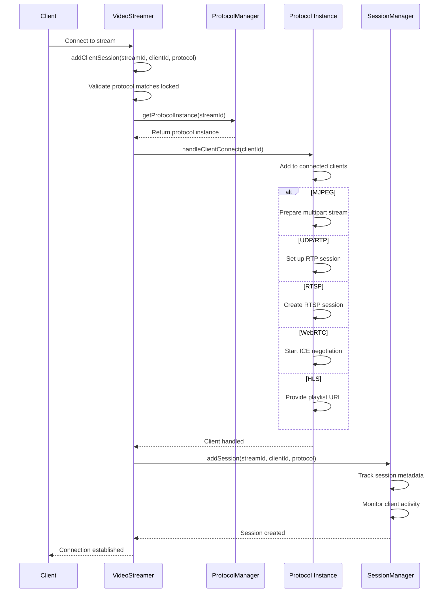
```mermaid
sequenceDiagram
    participant Client
    participant VS as VideoStreamer
    participant PM as ProtocolManager
    participant Proto as Protocol Instance
    participant SM as SessionManager
    
    Client->>VS: Connect to stream
    VS->>VS: addClientSession(streamId, clientId, protocol)
    VS->>VS: Validate protocol matches locked
    VS->>PM: getProtocolInstance(streamId)
    
    PM-->>VS: Return protocol instance
    VS->>Proto: handleClientConnect(clientId)
    
    Proto->>Proto: Add to connected clients
    alt MJPEG
        Proto->>Proto: Prepare multipart stream
    else UDP/RTP
        Proto->>Proto: Set up RTP session
    else RTSP
        Proto->>Proto: Create RTSP session
    else WebRTC
        Proto->>Proto: Start ICE negotiation
    else HLS
        Proto->>Proto: Provide playlist URL
    end
    
    Proto-->>VS: Client handled
    VS->>SM: addSession(streamId, clientId, protocol)
    SM->>SM: Track session metadata
    SM->>SM: Monitor client activity
    SM-->>VS: Session created
    VS-->>Client: Connection established
```

## Protocol-Specific Features

### MJPEG Protocol

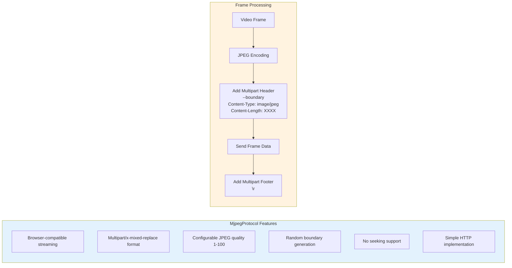
```mermaid
graph LR
    subgraph Features [MjpegProtocol Features]
        F1[Browser-compatible streaming]
        F2[Multipart/x-mixed-replace format]
        F3[Configurable JPEG quality 1-100]
        F4[Random boundary generation]
        F5[No seeking support]
        F6[Simple HTTP implementation]
    end
    
    subgraph Processing [Frame Processing]
        VF[Video Frame] --> JE[JPEG Encoding]
        JE --> AMH[Add Multipart Header<br/>--boundary<br/>Content-Type: image/jpeg<br/>Content-Length: XXXX]
        AMH --> SFD[Send Frame Data]
        SFD --> AMF[Add Multipart Footer<br/>\r\n]
    end
    
    style Features fill:#e3f2fd
    style Processing fill:#fff3e0
```

### UDP/RTP Protocol

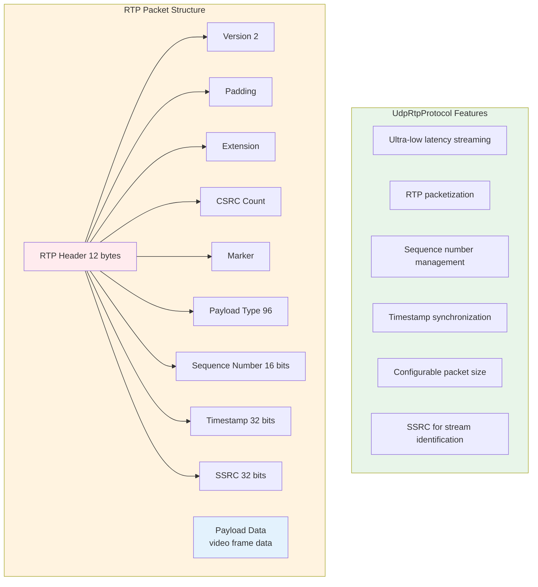
```mermaid
graph TB
    subgraph Features [UdpRtpProtocol Features]
        F1[Ultra-low latency streaming]
        F2[RTP packetization]
        F3[Sequence number management]
        F4[Timestamp synchronization]
        F5[Configurable packet size]
        F6[SSRC for stream identification]
    end
    
    subgraph Packet [RTP Packet Structure]
        RH[RTP Header 12 bytes]
        RH --> V[Version 2]
        RH --> P[Padding]
        RH --> X[Extension]
        RH --> CC[CSRC Count]
        RH --> M[Marker]
        RH --> PT[Payload Type 96]
        RH --> SN[Sequence Number 16 bits]
        RH --> TS[Timestamp 32 bits]
        RH --> SS[SSRC 32 bits]
        PD[Payload Data<br/>video frame data]
    end
    
    style Features fill:#e8f5e9
    style Packet fill:#fff3e0
    style RH fill:#ffebee
    style PD fill:#e3f2fd
```

### RTSP Protocol

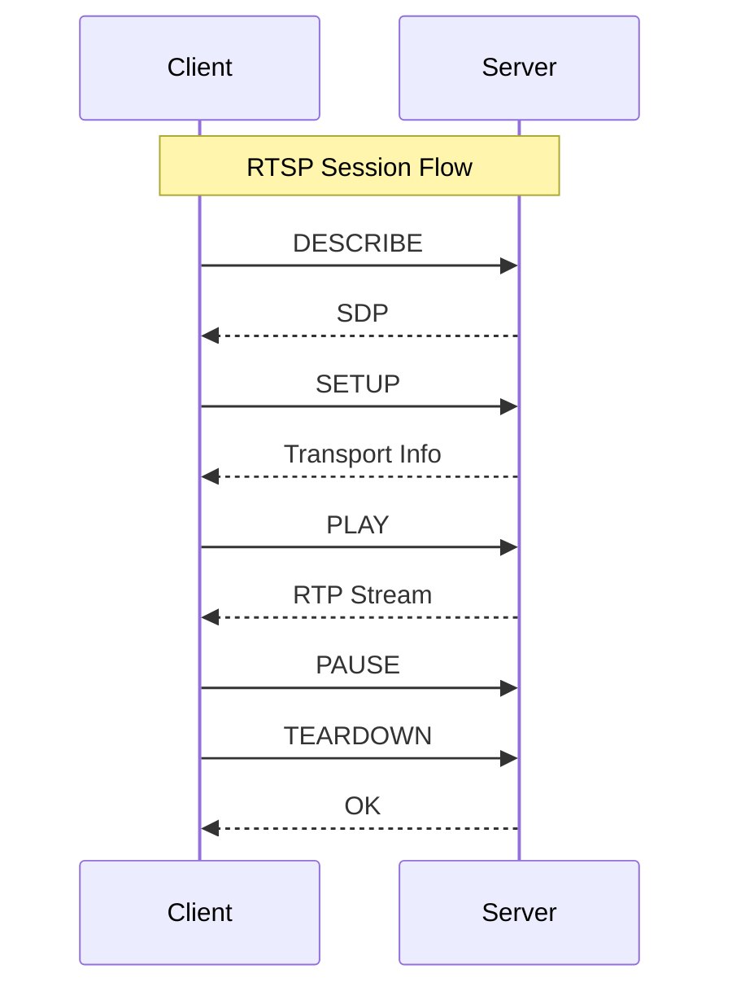
```mermaid
sequenceDiagram
    participant C as Client
    participant S as Server
    
    Note over C,S: RTSP Session Flow
    
    C->>S: DESCRIBE
    S-->>C: SDP
    
    C->>S: SETUP
    S-->>C: Transport Info
    
    C->>S: PLAY
    S-->>C: RTP Stream
    
    C->>S: PAUSE
    
    C->>S: TEARDOWN
    S-->>C: OK
```

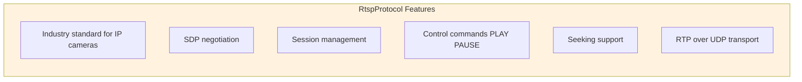
```mermaid
graph LR
    subgraph Features [RtspProtocol Features]
        F1[Industry standard for IP cameras]
        F2[SDP negotiation]
        F3[Session management]
        F4[Control commands PLAY PAUSE]
        F5[Seeking support]
        F6[RTP over UDP transport]
    end
    
    style Features fill:#fff3e0
```

### WebRTC Protocol

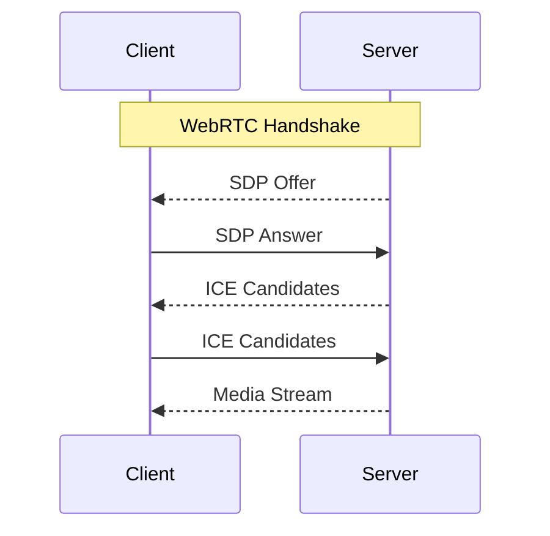
```mermaid
sequenceDiagram
    participant C as Client
    participant S as Server
    
    Note over C,S: WebRTC Handshake
    
    S-->>C: SDP Offer
    C->>S: SDP Answer
    
    S-->>C: ICE Candidates
    C->>S: ICE Candidates
    
    S-->>C: Media Stream
```

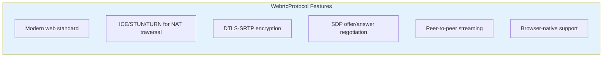
```mermaid
graph LR
    subgraph Features [WebrtcProtocol Features]
        F1[Modern web standard]
        F2[ICE/STUN/TURN for NAT traversal]
        F3[DTLS-SRTP encryption]
        F4[SDP offer/answer negotiation]
        F5[Peer-to-peer streaming]
        F6[Browser-native support]
    end
    
    style Features fill:#e3f2fd
```

### HLS Protocol

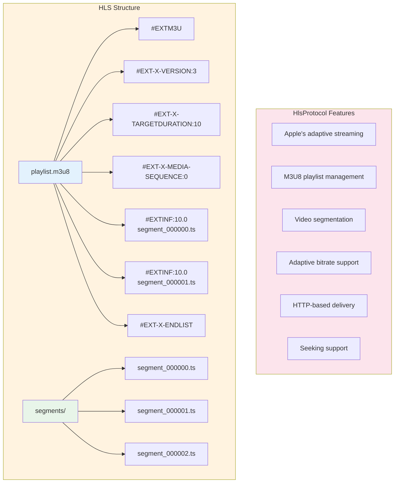
```mermaid
graph TB
    subgraph Features [HlsProtocol Features]
        F1[Apple's adaptive streaming]
        F2[M3U8 playlist management]
        F3[Video segmentation]
        F4[Adaptive bitrate support]
        F5[HTTP-based delivery]
        F6[Seeking support]
    end
    
    subgraph Structure [HLS Structure]
        PL[playlist.m3u8]
        PL --> EX1[#EXTM3U]
        PL --> EX2[#EXT-X-VERSION:3]
        PL --> EX3[#EXT-X-TARGETDURATION:10]
        PL --> EX4[#EXT-X-MEDIA-SEQUENCE:0]
        PL --> SE1[#EXTINF:10.0<br/>segment_000000.ts]
        PL --> SE2[#EXTINF:10.0<br/>segment_000001.ts]
        PL --> EL[#EXT-X-ENDLIST]
        
        SG[segments/]
        SG --> TS1[segment_000000.ts]
        SG --> TS2[segment_000001.ts]
        SG --> TS3[segment_000002.ts]
    end
    
    style Features fill:#fce4ec
    style Structure fill:#fff3e0
    style PL fill:#e3f2fd
    style SG fill:#e8f5e9
```

## Resource Management

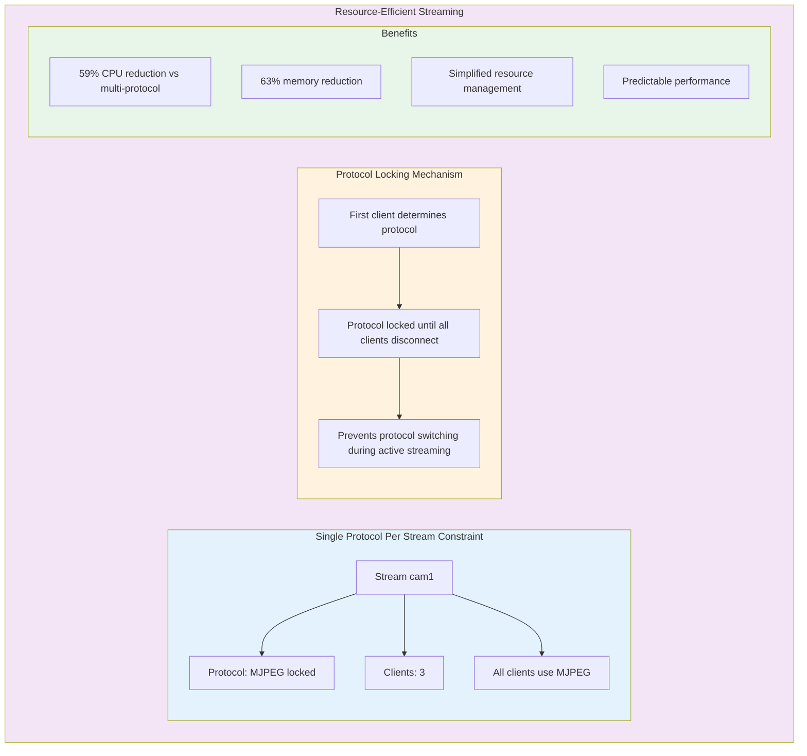
```mermaid
graph TB
    subgraph RE [Resource-Efficient Streaming]
        subgraph SPS [Single Protocol Per Stream Constraint]
            S1[Stream cam1]
            S2[Protocol: MJPEG locked]
            S3[Clients: 3]
            S4[All clients use MJPEG]
            S1 --> S2
            S1 --> S3
            S1 --> S4
        end
        
        subgraph PL [Protocol Locking Mechanism]
            L1[First client determines protocol]
            L2[Protocol locked until all clients disconnect]
            L3[Prevents protocol switching during active streaming]
            L1 --> L2
            L2 --> L3
        end
        
        subgraph BEN [Benefits]
            B1[59% CPU reduction vs multi-protocol]
            B2[63% memory reduction]
            B3[Simplified resource management]
            B4[Predictable performance]
        end
    end
    
    style RE fill:#f3e5f5
    style SPS fill:#e3f2fd
    style PL fill:#fff3e0
    style BEN fill:#e8f5e9
```

## Statistics and Monitoring

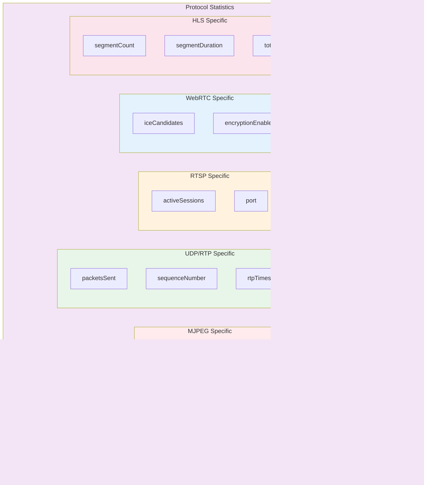
```mermaid
graph TB
    subgraph PS [Protocol Statistics]
        subgraph CS [Common Statistics All Protocols]
            C1[framesProcessed]
            C2[bytesSent]
            C3[clientCount]
            C4[streaming status]
            C5[uptime]
        end
        
        subgraph MJ [MJPEG Specific]
            M1[quality]
            M2[boundary string]
        end
        
        subgraph UR [UDP/RTP Specific]
            U1[packetsSent]
            U2[sequenceNumber]
            U3[rtpTimestamp]
            U4[ssrc]
        end
        
        subgraph RS [RTSP Specific]
            R1[activeSessions]
            R2[port]
        end
        
        subgraph WC [WebRTC Specific]
            W1[iceCandidates]
            W2[encryptionEnabled]
        end
        
        subgraph HS [HLS Specific]
            H1[segmentCount]
            H2[segmentDuration]
            H3[totalSegmentsCreated]
        end
    end
    
    style PS fill:#f3e5f5
    style CS fill:#e3f2fd
    style MJ fill:#ffebee
    style UR fill:#e8f5e9
    style RS fill:#fff3e0
    style WC fill:#e3f2fd
    style HS fill:#fce4ec
```

## Extension Points

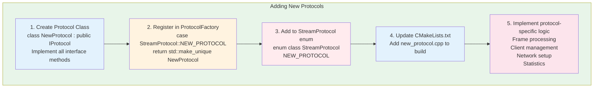
```mermaid
graph TB
    subgraph ANP [Adding New Protocols]
        S1[1. Create Protocol Class<br/>class NewProtocol : public IProtocol<br/>Implement all interface methods]
        S2[2. Register in ProtocolFactory<br/>case StreamProtocol::NEW_PROTOCOL<br/>return std::make_unique NewProtocol]
        S3[3. Add to StreamProtocol enum<br/>enum class StreamProtocol<br/>NEW_PROTOCOL]
        S4[4. Update CMakeLists.txt<br/>Add new_protocol.cpp to build]
        S5[5. Implement protocol-specific logic<br/>Frame processing<br/>Client management<br/>Network setup<br/>Statistics]
        
        S1 --> S2
        S2 --> S3
        S3 --> S4
        S4 --> S5
    end
    
    style ANP fill:#e8f5e9
    style S1 fill:#e3f2fd
    style S2 fill:#fff3e0
    style S3 fill:#ffebee
    style S4 fill:#e3f2fd
    style S5 fill:#fce4ec
```

## File Structure

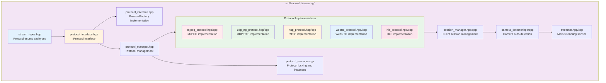
```mermaid
graph TB
    subgraph Streaming [src/bmcweb/streaming/]
        ST[stream_types.hpp<br/>Protocol enums and types]
        PI[protocol_interface.hpp<br/>IProtocol interface]
        PIC[protocol_interface.cpp<br/>ProtocolFactory implementation]
        PM[protocol_manager.hpp<br/>Protocol management]
        PMC[protocol_manager.cpp<br/>Protocol locking and instances]
        
        subgraph Protocols [Protocol Implementations]
            MJ[mjpeg_protocol.hpp/cpp<br/>MJPEG implementation]
            UR[udp_rtp_protocol.hpp/cpp<br/>UDP/RTP implementation]
            RS[rtsp_protocol.hpp/cpp<br/>RTSP implementation]
            WC[webrtc_protocol.hpp/cpp<br/>WebRTC implementation]
            HS[hls_protocol.hpp/cpp<br/>HLS implementation]
        end
        
        SM[session_manager.hpp/cpp<br/>Client session management]
        CD[camera_detector.hpp/cpp<br/>Camera auto-detection]
        VS[streamer.hpp/cpp<br/>Main streaming service]
    end
    
    ST --> PI
    PI --> PIC
    PI --> PM
    PM --> PMC
    PM --> Protocols
    Protocols --> SM
    SM --> CD
    CD --> VS
    
    style Streaming fill:#f3e5f5
    style Protocols fill:#e8f5e9
    style ST fill:#e3f2fd
    style PI fill:#fff3e0
    style MJ fill:#ffebee
    style UR fill:#e8f5e9
    style RS fill:#fff3e0
    style WC fill:#e3f2fd
    style HS fill:#fce4ec
```

## API Endpoints

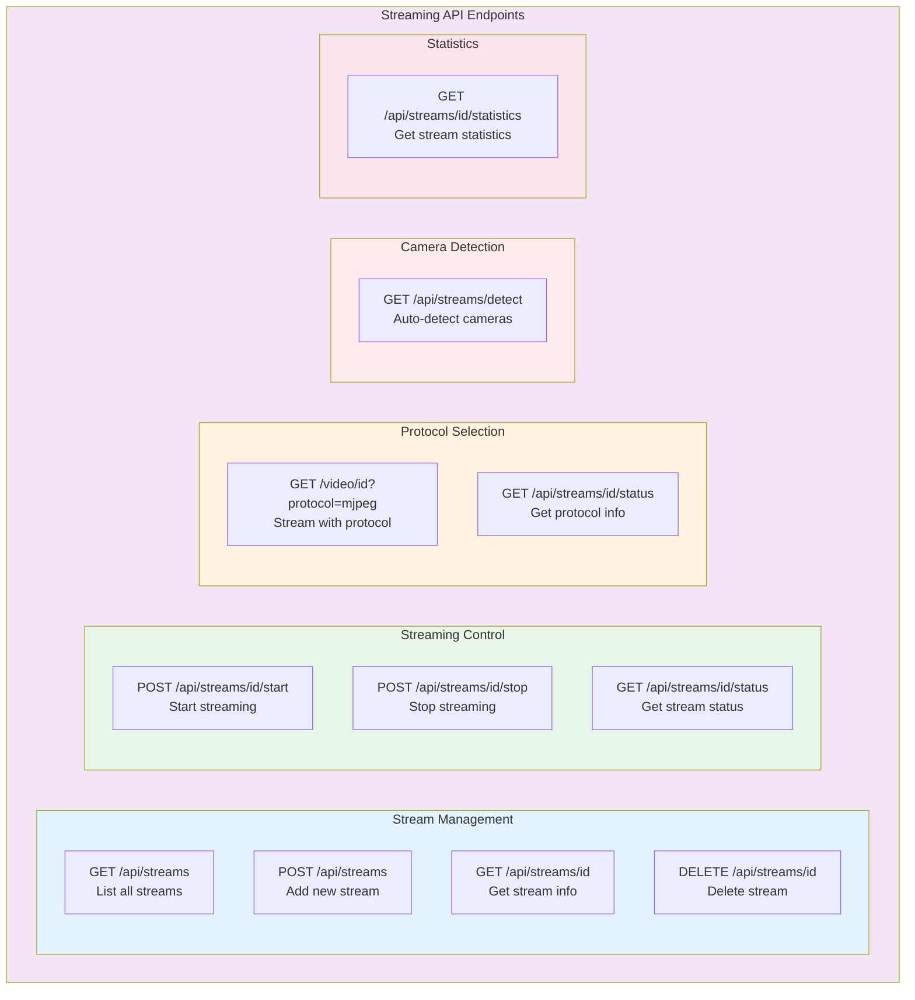
```mermaid
graph TB
    subgraph API [Streaming API Endpoints]
        subgraph SM [Stream Management]
            M1[GET /api/streams<br/>List all streams]
            M2[POST /api/streams<br/>Add new stream]
            M3[GET /api/streams/id<br/>Get stream info]
            M4[DELETE /api/streams/id<br/>Delete stream]
        end
        
        subgraph SC [Streaming Control]
            C1[POST /api/streams/id/start<br/>Start streaming]
            C2[POST /api/streams/id/stop<br/>Stop streaming]
            C3[GET /api/streams/id/status<br/>Get stream status]
        end
        
        subgraph PS [Protocol Selection]
            P1[GET /video/id?protocol=mjpeg<br/>Stream with protocol]
            P2[GET /api/streams/id/status<br/>Get protocol info]
        end
        
        subgraph CD [Camera Detection]
            D1[GET /api/streams/detect<br/>Auto-detect cameras]
        end
        
        subgraph ST [Statistics]
            S1[GET /api/streams/id/statistics<br/>Get stream statistics]
        end
    end
    
    style API fill:#f3e5f5
    style SM fill:#e3f2fd
    style SC fill:#e8f5e9
    style PS fill:#fff3e0
    style CD fill:#ffebee
    style ST fill:#fce4ec
```

## Benefits Summary

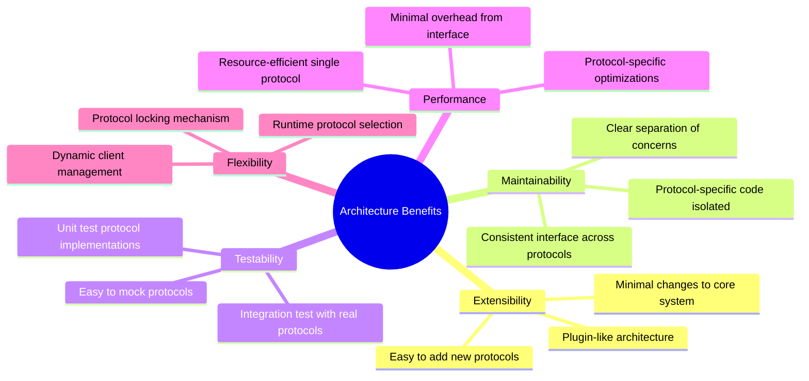
```mermaid
mindmap
  root((Architecture Benefits))
    Extensibility
      Easy to add new protocols
      Plugin-like architecture
      Minimal changes to core system
    Maintainability
      Clear separation of concerns
      Protocol-specific code isolated
      Consistent interface across protocols
    Testability
      Easy to mock protocols
      Unit test protocol implementations
      Integration test with real protocols
    Performance
      Resource-efficient single protocol
      Protocol-specific optimizations
      Minimal overhead from interface
    Flexibility
      Runtime protocol selection
      Protocol locking mechanism
      Dynamic client management
```

## Usage Example

```cpp
// Add a stream with specific protocol
StreamConfig config;
config.id = "camera1";
config.name = "Front Camera";
config.type = StreamSourceType::CAMERA_DEVICE;
config.sourcePath = "/dev/video0";
config.protocol = StreamProtocol::RTSP;
config.port = 8554;

auto& streamer = VideoStreamer::getInstance();
streamer.addStream(config);

// Start streaming
streamer.startStreaming("camera1");

// Get protocol instance for custom operations
auto protocol = protocolManager.getProtocolInstance("camera1");
if (protocol) {
    // Protocol-specific operations
    if (protocol->getProtocolType() == StreamProtocol::RTSP) {
        auto rtspProtocol = std::dynamic_pointer_cast<RtspProtocol>(protocol);
        std::string sdp = rtspProtocol->getSdp();
    }
}
```

This architecture provides a solid foundation for streaming multiple protocols while maintaining resource efficiency and code organization.